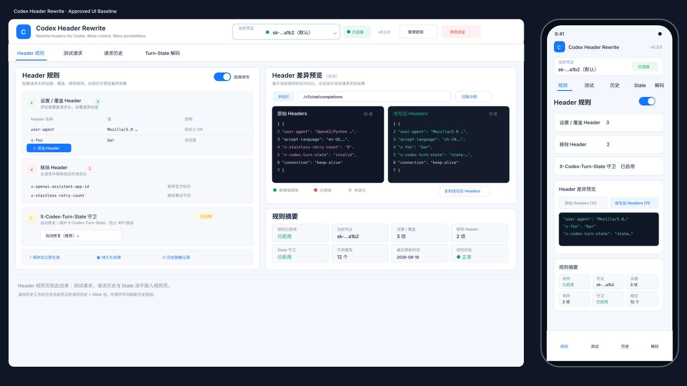

# UI 设计基准与开发规范

> 本文是 Codex Header Rewrite 前端 UI 的长期设计基准。  
> 后续任何 UI 重构、样式优化或交互调整，都应先对照本文和参考图，再修改 `web/index.html`。

## 1. 设计基准

当前已确认的 UI 方向不是通用后台模板，而是：

- **插件控制台**，不是完整独立 SaaS 后台。
- **无侧边栏**，凭证和功能导航都在顶部完成。
- **高信息密度**，尽量让操作者在一屏内看到“规则、差异、状态、诊断”。
- **开发者工具风格**，强调结构、可读性、状态语义和代码视图。
- **桌面端优先双栏，移动端重新编排**，不是单纯缩放 PC 页面。
- **浅色主界面 + 深色代码 Diff**，避免整个页面过暗导致信息层次变弱。

### 视觉参考图



仓库内参考图：

- `docs/ui/approved-ui-reference.svg`
- 当前实现：`web/index.html`
- 对应实现分支：`ui/mockup-parity-density`

这张图代表已确认的信息架构和视觉方向。后续优化可以继续精修，但不应退回到“低密度、大留白、普通后台模板”的方向。

---

## 2. 核心设计目标

### 2.1 首屏必须回答 4 个问题

用户打开插件后，应能在不跳转页面的情况下快速确认：

1. **当前操作的是哪个凭证**
2. **这个凭证启用了哪些 Header 规则**
3. **规则会如何改变真实请求 Header**
4. **插件当前运行状态是否正常**

因此首屏必须保留：

- 当前凭证
- 启用改写状态
- 设置 / 覆盖 Header
- 移除 Header
- X-Codex-Turn-State 守卫
- Header 差异预览
- 规则摘要

### 2.2 信息密度优先

本插件的主要用户是需要调试代理链、Header、模型和 Turn-State 的开发者。

因此：

- 卡片之间留白要小于普通 SaaS Dashboard。
- 表格和代码区域应优先展示更多有效信息。
- 不要为了“简洁”把核心数据藏进多层弹窗。
- 高级设置可以折叠，但核心状态不能隐藏。
- 桌面端目标是尽量在 **1440px 宽度的一屏**里看到主要规则和差异。

---

## 3. 页面整体结构

### 3.1 顶部 Header

从左到右：

1. 产品 Logo
2. 产品名 `Codex Header Rewrite`
3. 简短副标题
4. 当前凭证切换器
5. 连接状态
6. 当前实际运行版本
7. 管理密钥
8. 清理遗留

### 3.2 功能导航

顶部横向 Tab：

- Header 规则
- 测试请求
- 请求历史
- Turn-State 解码

State 池不再使用独立标签页，统一放在“请求历史”工作区下方，并且只展示当前凭证的数据。

禁止重新引入左侧固定导航。

原因：这是宿主中的插件页面，不应表现得像另一个完整后台系统。

---

## 4. 凭证切换器

凭证切换是高频操作，必须保持为顶部一级交互。

### 4.1 禁止使用简单原生 Select

目标交互是自定义 Popover：

- 当前凭证邮箱（首要显示字段）
- 邮箱不可用时才回退 label / name / auth_index
- 默认凭证标记
- 已连接状态
- 点击展开
- 搜索凭证
- 凭证列表
- 每个凭证显示：
  - 邮箱名
  - 是否默认
  - 是否已有规则
  - 历史数量 / 状态
- 搜索同时匹配邮箱、auth_index、label 和 name
- 刷新凭证
- 管理凭证入口

### 4.2 切换要求

切换凭证后必须同步更新：

- Header 规则
- Header Diff
- 可用模型
- 请求历史
- State 池
- 规则摘要

不能出现上一个凭证的数据短暂残留。

---

## 5. Header 规则区

桌面端左栏是主要编辑区。

规则分为三个固定区块：

### 5.1 设置 / 覆盖 Header

每行必须包含：

| 字段 | 说明 |
|---|---|
| Header 名称 | 如 `user-agent` |
| 值 | 最终写入值 |
| 说明 | 简短语义说明 |
| 操作 | 删除 |

规则列表应保持紧凑。

推荐说明示例：

- `user-agent` → 自定义 UA
- `accept-language` → 语言优先级
- `x-openai-assistant-app-id` → 官方客户端标识
- `x-stainless-retry-count` → 重试控制
- `x-codex-turn-state` → 回合状态

### 5.2 移除 Header

同样保持表格式高密度布局。

显示：

- Header 名称
- 说明
- 删除操作

### 5.3 X-Codex-Turn-State 守卫

必须明确显示：

- 是否启用
- 当前守卫模式
- 简短说明
- 与 State 池的关系

业务规则不能为了 UI 简化而改变：

> 手工设置或手工移除 `X-Codex-Turn-State` 的优先级高于自动守卫 / 自动注入。

---

## 6. Header 差异预览

这是整个 UI 最重要的视觉区域之一。

### 6.1 桌面端

使用 **左右双代码窗**：

- 左：原始 Headers
- 右：改写后 Headers

代码窗使用深色背景，与整体浅色页面形成明确视觉焦点。

必须显示：

- Header 数量
- 行号
- JSON / Header 样式排版
- 新增 / 修改 / 删除状态色
- 示例请求
- 切换示例
- 复制改写后 Headers
- 格式化

### 6.2 状态颜色

推荐语义：

| 类型 | 颜色 |
|---|---|
| 新增 / 修改 | 绿色 |
| 删除 | 红色 |
| 普通 / 未变化 | 中性灰 |
| 主要交互 | 蓝色 |
| 警告 / State | 黄色 / 琥珀色 |

禁止用过多不具备语义的装饰色。

### 6.3 实时预览

编辑以下内容时，Diff 应立即刷新：

- Header 名称
- Header 值
- 移除项
- 启用改写
- State 守卫

不应该要求用户先发送测试请求才能看到规则效果。

真实测试请求返回后，可以临时展示实际 Before / After；回到规则页时重新显示规则实时预览。

即时示例仅计算手工 Set/Remove，并在预览标题明确说明。自动 State 注入需要请求时的套餐、模型和来源信息，不能凭守卫开关生成假 state；实际自动处理结果查看请求历史。测试概览只展示后端返回的实际测试或预览结果，不复用规则示例数据。

切换凭证立即清空旧内容、禁用规则编辑和保存；只有目标凭证规则加载成功后恢复操作。所有异步读取应检查选择代次，防止 A→B→A 快速切换时迟到响应覆盖当前内容。State 概览只统计当前凭证的未过期记录，完整池仍保留其过期记录供查看。

---

## 7. 规则摘要

桌面端右侧 Diff 下方保持紧凑摘要卡。

推荐 8 项：

1. 规则是否启用
2. 当前凭证
3. 设置 / 覆盖数量
4. 移除数量
5. State 守卫
6. 可用模型
7. 最后更新时间
8. 规则运行状态

摘要卡的作用是“扫一眼确认状态”，不是承载长文本。

---

## 8. 运行策略

规则编辑区下方保留紧凑说明：

- 保存后下一请求立即生效
- 规则持久化
- 历史脱敏记录

桌面端可三列并排。

移动端默认收起或仅显示摘要标题，避免占据首屏。

---

## 9. Header 规则页边界

Header 规则页只承载：

- Header 规则编辑
- 实时 Header Diff
- 规则摘要
- 运行策略

**不要**在 Header 规则页底部再嵌入测试请求、请求历史、State 池或 Turn-State 解码概览。

测试请求、请求历史和 Turn-State 解码分别进入各自顶部工作区；State 池并入请求历史工作区。

## 10. 请求历史完整页

请求历史必须保持“诊断工具”风格，而不是普通列表。

顶部统计：

- 总记录
- 成功率
- 401 / 429
- 平均延迟

标题栏必须提供“刷新”按钮，用于手动重新拉取当前凭证当前页的请求历史。

表格至少保留：

- 时间
- 来源 / Method
- 模型链
- 结果
- 耗时
- 状态码

点击记录后，应在当前记录下方原地展开：

- Request Header 差异
- Response Header
- X-Codex-Turn-State
- 上游模型
- Request ID
- 流式 / 非流式
- 其他诊断信息

避免跳到独立详情页。

### 10.1 State 池

State 池固定放在请求历史表格下方，不提供独立顶级标签页。

要求：

- 请求接口必须带当前 `auth_index`
- 前端再次按当前 `auth_index` 校验过滤
- 标题区域显示当前凭证邮箱和 State 条数
- 切换凭证后 State 池必须同步清空并重新加载
- 允许单独刷新 State 池
- 过期 State 可以显示，但绝不能混入其他凭证的 State

---

## 11. 移动端规范

移动端不是桌面布局直接缩小。

### 11.1 顶部

移动端顶部采用两行：

第一行：

- Logo
- 产品名
- 版本
- 管理入口

第二行：

- 当前凭证
- 连接状态
- 下拉入口

### 11.2 功能导航

顶部保留精简 Tab：

- 规则
- 测试
- 历史
- 解码

State 池在“历史”页面内，不占用移动端独立导航位。

底部也保留固定导航，方便单手操作。

### 11.3 规则区

规则区块默认折叠：

- 设置 / 覆盖
- 移除
- State 守卫

显示数量 Badge。

### 11.4 Diff

手机不强行左右并排。

改成：

- 原始 Headers
- 改写后 Headers

两个 Tab 切换。

默认优先显示“改写后 Headers”。

### 11.5 规则摘要

采用 3 列紧凑 Tile。

首屏应至少看到：

- Header 规则
- 三个规则分组
- Header 差异预览入口 / 部分内容
- 规则摘要

---

## 12. 视觉 Token

当前目标 Token：

```css
--bg: #f3f6fb;
--surface: #ffffff;
--sunk: #f7f9fd;

--line: #e3eaf4;
--line-strong: #cfd9e8;

--text: #13233d;
--text-soft: #536780;
--text-mute: #8593a7;

--accent: #1677ff;
--accent-hover: #0f68e5;
--accent-weak: #edf5ff;

--set: #13a36d;
--set-weak: #eaf9f2;

--gone: #ef4d55;
--gone-weak: #fff0f1;

--over: #f3a516;
--over-weak: #fff6df;
```

### 圆角

- 控件：6–8px
- 卡片：7–10px
- Badge / 状态：圆角 Pill

### 阴影

尽量轻。

主要靠：

- 边框
- 背景差异
- 信息分组

来建立层级，不做大面积浮夸阴影。

---

## 13. Typography

推荐：

### 普通 UI

```css
system-ui,
-apple-system,
"Segoe UI",
"Noto Sans CJK SC",
"PingFang SC",
"Microsoft YaHei",
sans-serif
```

### Header / Token / JSON

```css
ui-monospace,
SFMono-Regular,
"SF Mono",
Menlo,
Consolas,
"Liberation Mono",
monospace
```

Header、auth_index、模型 ID、JSON、token 摘要尽量使用 monospace。

---

## 14. 交互优先级

### 一级操作

使用蓝色：

- 保存规则
- 发送测试请求
- 解码
- 关键刷新操作

### 二级操作

白底描边：

- 放弃修改
- 预览 Header
- 格式化
- 管理密钥

### 危险操作

红色 / 浅红背景：

- 删除规则
- 清空历史
- 清理遗留

危险按钮不得与主操作使用相同的蓝色视觉权重。

---

## 15. 数据真实性原则

UI 中所有看起来像运行数据的内容，都必须来自真实数据或明确标记为示例。

禁止：

- 未发送测试请求时显示假 `200`
- 没有实际请求时伪造延迟
- 把“未知”显示成“正常”
- 把“来源未知”显示成“回带一致”
- 用 UI 演示数据覆盖真实状态

示例 Header 只允许用于“规则实时预览”，并必须标识为示例。

---

## 16. 响应式断点

建议：

### Desktop

`> 1200px`

- 规则 / Diff 左右双栏
- 底部四模块概览

### Compact Desktop / Tablet

`821px – 1200px`

- 仍优先保留双栏
- 必要时降低最小列宽
- 底部模块改 2×2

### Mobile

`<= 820px`

- 单栏
- Header 两行
- 规则分组折叠
- Diff 切换
- 底部固定导航

### Narrow Mobile

`<= 520px`

- 进一步压缩文字
- 摘要保持 3 列
- 表格转卡片 / 两列信息布局
- 主按钮保证触控面积

---

## 17. 不可回退项

后续优化时，以下设计原则视为基线，不应无意中删除：

- 不使用左侧 Sidebar
- 凭证必须快速切换
- 凭证切换支持搜索
- Header Diff 必须是强视觉区域
- 桌面端 Header Diff 使用双代码窗
- 规则修改实时预览
- 规则页面信息密度高
- 桌面端首屏尽可能同时看到规则和结果
- 移动端使用独立重排逻辑
- 状态颜色必须有明确语义
- UI 展示的运行数据必须真实

如果需要改变这些原则，应把它视为一次新的设计决策，而不是普通 CSS 调整。

---

## 18. 后续优化方向

后续可以继续优化：

- 凭证环境标签：默认 / 项目 / 测试 / 备用
- 凭证收藏 / 最近使用
- Header 行拖拽排序
- Header 常用模板
- Diff 搜索
- Diff 仅看变化
- Copy 单项 Header
- History 筛选：
  - 401
  - 429
  - switched
  - model mismatch
  - cross account
  - cross model
- State 池筛选与排序
- Turn-State 结构可视化
- Keyboard shortcuts
- 更完整的 loading / empty / error 状态
- Accessibility
- 更严格的视觉回归测试

---

## 19. UI 修改流程

以后修改 UI，推荐按以下顺序：

1. 先更新本文或参考图，明确要改什么。
2. 对照 `docs/ui/approved-ui-reference.svg`。
3. 修改 `web/index.html`。
4. 检查 PC：
   - 1440×900
   - 1920×1080
5. 检查移动端：
   - 390×844
   - 430×932
6. 检查：
   - 凭证切换
   - 规则编辑
   - 实时 Diff
   - 保存 / 放弃 / 删除
   - 测试请求
   - History
   - State
   - Decode
7. 最后再做颜色、间距、动画等视觉微调。

不要一开始只做 CSS 微调而不核对信息架构。

---

## 20. UI PR 验收 Checklist

### Desktop

- [ ] 没有左侧导航
- [ ] 当前凭证始终容易找到
- [ ] 凭证切换不超过 2 次点击
- [ ] 凭证下拉首要显示邮箱
- [ ] 凭证列表可搜索
- [ ] 规则 / Diff 同屏
- [ ] 设置、移除、守卫层次明显
- [ ] Diff Before / After 同屏
- [ ] 修改规则后 Diff 立即更新
- [ ] 摘要信息一眼可读
- [ ] Header 规则页不混入测试请求 / 请求历史 / State 池
- [ ] 请求历史页包含当前凭证 State 池
- [ ] 请求历史提供刷新按钮
- [ ] 主 / 次 / 危险按钮视觉层级正确

### Mobile

- [ ] 当前凭证在顶部
- [ ] 规则区块默认折叠
- [ ] Diff 可切换 Before / After
- [ ] 改写后结果优先显示
- [ ] 摘要 Tile 不溢出
- [ ] 底部导航可单手操作
- [ ] 没有横向页面溢出

### Data / Behavior

- [ ] 切凭证后不残留旧数据
- [ ] 实时预览遵守真实规则优先级
- [ ] 手工 Turn-State Set / Remove 优先于自动注入
- [ ] 未执行请求时不显示伪造成功结果
- [ ] 敏感 Header 继续遵守脱敏逻辑
- [ ] UI 改动没有改变后端 API 语义

---

## 21. 当前实现约束

当前前端仍保持：

- 单文件 `web/index.html`
- 不引入 React / Vue
- 不增加外部 CDN 依赖
- 不要求 Node 构建步骤
- 保持 CLIProxyAPI 插件内嵌 UI 的部署方式

如果未来要引入构建系统，应单独评估：

- 插件打包体积
- 宿主资源加载方式
- CSP / 外部资源限制
- 离线使用
- Release 流程

不要只为了组件化而引入大型前端框架。
